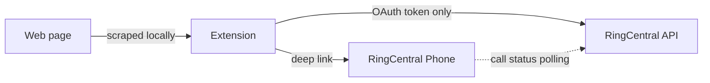

# Privacy & Permissions

## What stays in your browser

- **Phone numbers and call activity stay in your browser.** The extension only sends call requests to RingCentral's official APIs; no third-party servers are involved.
- **Page scraping** runs locally — content of the pages you scan is not transmitted anywhere.
- **OAuth tokens** are stored in Chrome's encrypted extension storage and used only to authenticate with RingCentral.

## Permissions the extension requests

| Permission | Why it's needed |
|---|---|
| **activeTab** | To read the page you're on so it can find phone numbers |
| **storage** | To remember your call list, settings, and OAuth tokens |
| **tabs** | To open the RingCentral phone in a background tab when dialing |
| **identity** | To run the OAuth flow with RingCentral |
| **scripting** | To inject the number-detection script into the active page |
| **alarms** | To schedule background polling for call status changes |
| **sidePanel** | To render the extension UI in Chrome's side panel |

## Data flow at a glance

## Third parties

There are none. The extension talks to RingCentral and Chrome's built-in APIs. Nothing else.

## Open source

The full source is at [github.com/georgelu-coderRC/ringcentral-quick-dialer](https://github.com/georgelu-coderRC/ringcentral-quick-dialer). Audit it, fork it, file issues.
