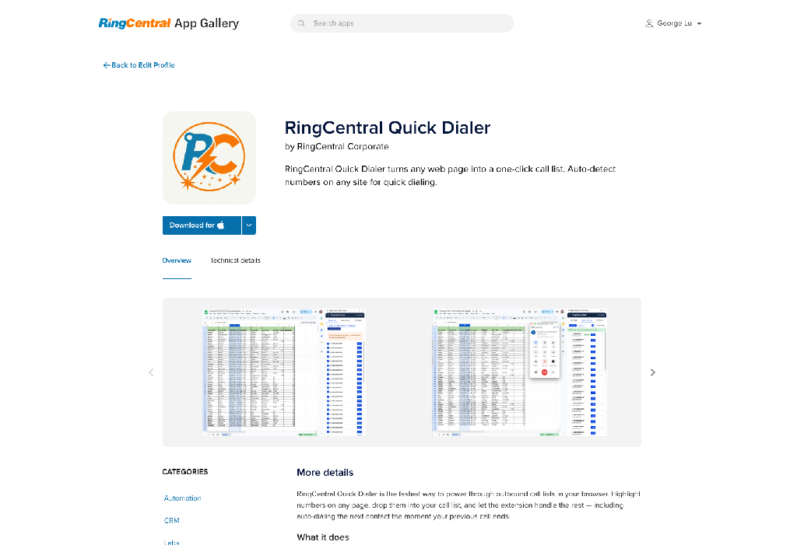
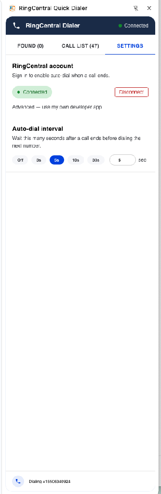

# Setup

RingCentral Quick Dialer is distributed through the **RingCentral App Gallery**. The extension is not published on the Chrome Web Store — instead you'll download a zip file and **sideload** it into Chrome's developer mode. This is a one-time setup that takes about a minute.

## Step 1. Install the extension

### 1a. Download from the RingCentral App Gallery

1. Open the [RingCentral App Gallery](https://www.ringcentral.com/apps/) and search for *"Quick Dialer"* (or follow the direct link your administrator shared).
2. On the **RingCentral Quick Dialer** listing page, click **Download**.
3. Save the zip file (e.g. `RingCentral-Quick-Dialer.zip`) to a permanent location such as `~/Documents/`.
4. Unzip the file. You should see a folder containing `manifest.json`, `icons/`, `assets/`, and other files.

### 1b. Sideload the extension into Chrome

1. Open `chrome://extensions` in Chrome (or click the puzzle-piece menu → **Manage Extensions**).
2. Toggle **Developer mode** on in the top-right corner.
3. Click **Load unpacked**.
4. Select the **unzipped folder** (the one that directly contains `manifest.json`).
5. The extension will appear in your extensions list. Pin it to your toolbar by clicking the puzzle-piece icon and the pin next to **RingCentral Quick Dialer**.

!!! danger "Important"
    Always select the unzipped folder that directly contains `manifest.json`. Selecting a parent folder will cause service-worker errors and the extension won't load.

!!! info "Why sideload?"
    RingCentral Quick Dialer ships through the App Gallery rather than the Chrome Web Store so that updates and access can be managed by your RingCentral administrator. Sideloading is a normal Chrome workflow — Developer mode is required because the extension isn't from the Web Store, but it's safe and stable.

!!! tip "Updates"
    When a new version is released to the App Gallery, download the new zip, unzip it, then go back to `chrome://extensions` and either click **Update** on the extension card, or remove the old version and load the new folder. Your RingCentral connection and call list will be preserved if you click Update; they will reset if you remove and re-add.

## Step 2. Connect your RingCentral account

1. Click the **Quick Dialer** icon in your Chrome toolbar to open the side panel.
2. Open the **Settings** tab.
3. Click **Connect to RingCentral**.
4. A RingCentral sign-in window opens — log in with your normal RingCentral credentials and approve access.
5. The window closes automatically. Settings will now show **Connected** with a green indicator.

<figure markdown>
  { width="320" }
  <figcaption>Settings tab. Once connected, you'll see a green "Connected" pill and the auto-dial interval controls.</figcaption>
</figure>

!!! note
    The extension uses RingCentral's official OAuth flow. Your password is never seen by the extension — only RingCentral handles your sign-in, and you can revoke access at any time from your RingCentral account.

## Step 3. Configure auto-dial timing

In **Settings → Auto-dial interval**, choose how long the extension should wait before dialing the next number when a call ends:

| Option   | Behavior                                            |
|----------|-----------------------------------------------------|
| **Off**  | Auto-dial disabled; click numbers manually          |
| **3s** / **5s** / **10s** / **30s** | Preset delays                            |
| **Custom** | Enter any value from 1 to 600 seconds in the input box |

!!! tip "Recommended starting point"
    **5 seconds** — enough time to take notes, short enough to keep momentum.
