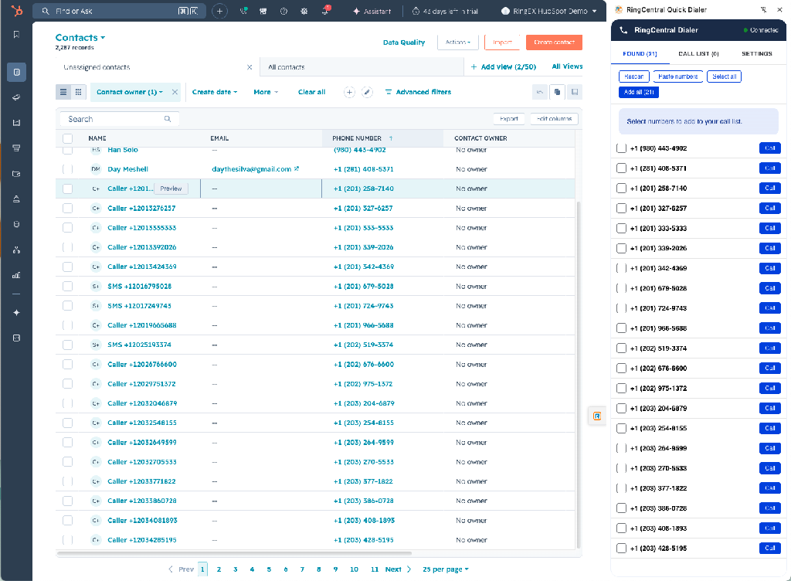
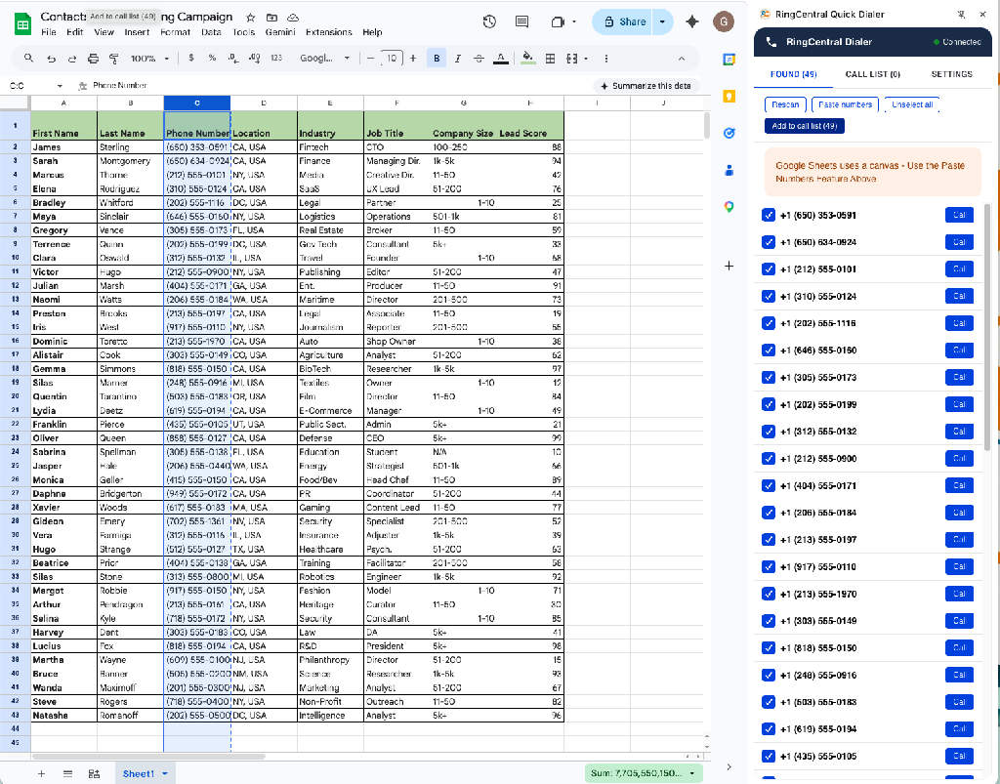
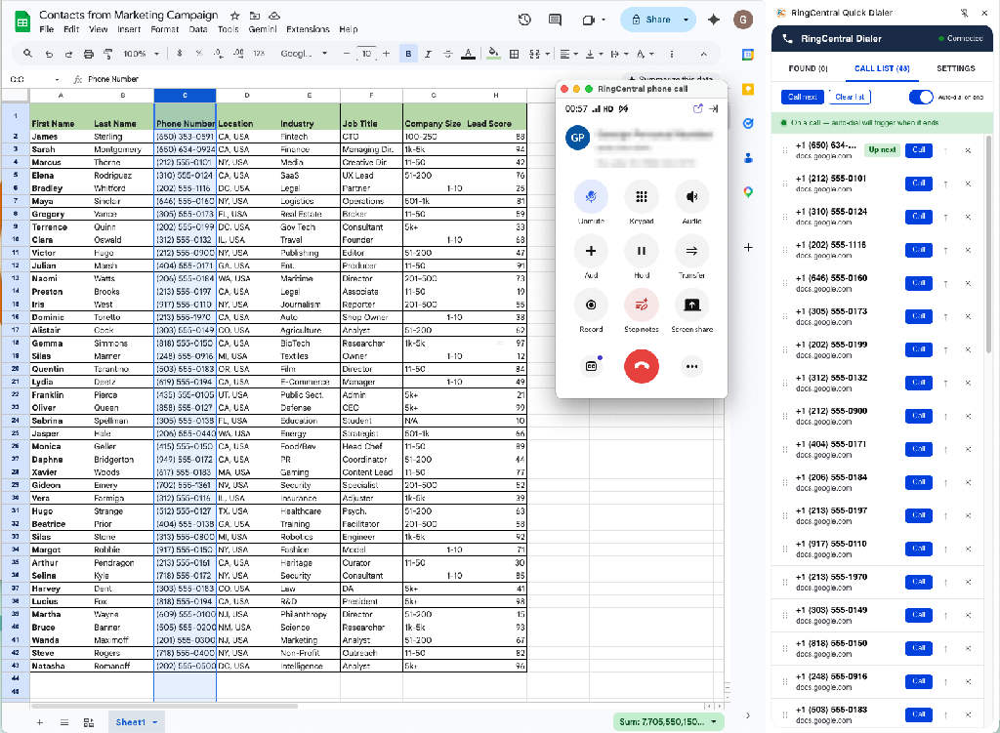

# Daily Usage

## The side panel at a glance

Click the Quick Dialer icon in your Chrome toolbar to open the side panel on the right side of your browser. The panel has three tabs:

| Tab | Purpose |
|---|---|
| **FOUND** | Phone numbers and contact names detected on the current web page (count shown in tab) |
| **CALL LIST** | Your dialing queue (count shown in tab) |
| **SETTINGS** | Connection and preferences |

## Adding contacts to your call list

=== "Method A — Scrape a page"

    Works on most CRMs, dashboards, and HTML-based pages.

    1. Navigate to a page containing phone numbers (e.g. a HubSpot contact list).
    2. Open the side panel and select the **FOUND** tab — the extension automatically scans the visible page and lists every phone number it detects, including nearby contact names when available.
    3. Use the checkboxes on the left to pick the numbers you want, or click **Select all**.
    4. Click **Add to call list** to send your selection to the call list.
    5. Or click the blue **Call** button next to any individual number to dial it immediately.

    

=== "Method B — Paste from a sheet"

    Google Sheets renders data on a canvas, so the extension can't scrape it directly. Use the **Paste names/numbers** feature instead.

    1. In your spreadsheet, select the name and phone columns and copy ([:material-apple-keyboard-command:+C] / [Ctrl+C]).
    2. Open the side panel and go to the **FOUND** tab.
    3. Click **Paste names/numbers**, paste your list into the box, and confirm.
    4. The extension normalizes every number to E.164 format and keeps the contact name beside it when one is pasted.
    5. Click **Add to call list** to queue them up.

    

=== "Method C — Manual entry"

    In the **CALL LIST** tab, type a contact name and phone number, then press **Add**.

## Working with your call list

Switch to the **CALL LIST** tab to manage and dial your queue.

- **Up next** — the first item is highlighted with a green "Up next" pill. This is the number that will be dialed when you click **Call next** or when auto-dial fires.
- **Name** — each row can show a contact name above the phone number.
- **Reorder** — drag any row by its grip handle (the dots on the left) to change the order. The "Up next" pill follows the top of the list.
- **Source** — each row shows where the number came from (e.g. `docs.google.com`) so you don't lose context.
- **Remove** — click the **×** on the right side of any row.
- **Clear list** — empties the entire call list.
- **Auto-dial toggle** — flip the blue switch to enable or disable auto-dial without changing your interval.

## Dialing a call

You have three ways to start a call:

1. **Call next** button — dials the top item in the call list.
2. **Call** button on any row — dials that specific number.
3. **Call** button in the Found tab — dials immediately without queueing.

When you click dial, the extension opens the RingCentral phone in a **background tab** and starts the call automatically. Your current tab stays focused so your workflow isn't disrupted.

## Watching the call status

The extension polls RingCentral and shows a live status indicator at the top of the panel:

| Status | Meaning |
|---|---|
| **Ready** | No active call; safe to dial |
| **Ringing** | Outbound call is connecting |
| **On a call** | Conversation in progress (green) |
| **Wrapping up** | Call ended; auto-dial timer running (amber) |

## Auto-dial on hangup

When a call ends and your call list still has numbers in it:

1. The status switches to **Wrapping up** with a countdown.
2. After your configured delay, the next number is dialed automatically.
3. To **skip the delay**, click **Call next** during the countdown.
4. To **cancel** the auto-dial, flip the auto-dial toggle off, or set the delay to **Off** in Settings.
